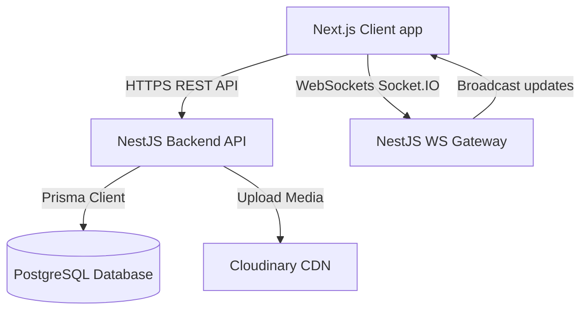
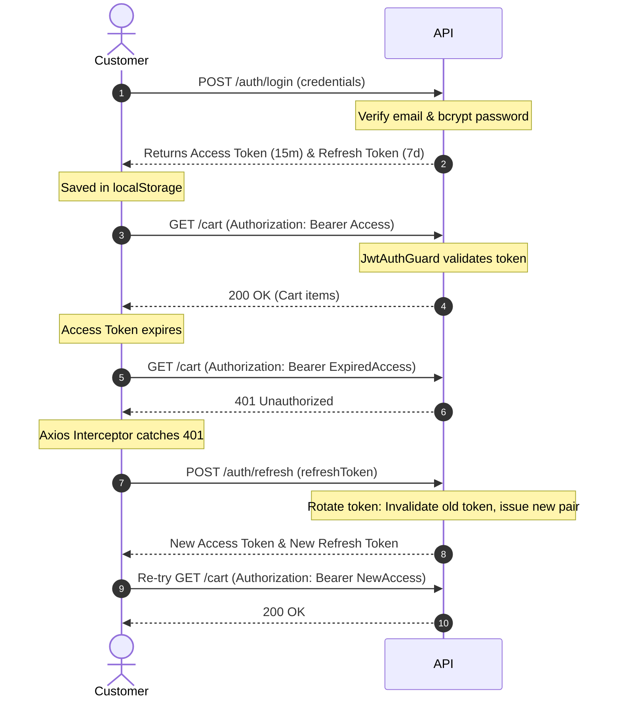
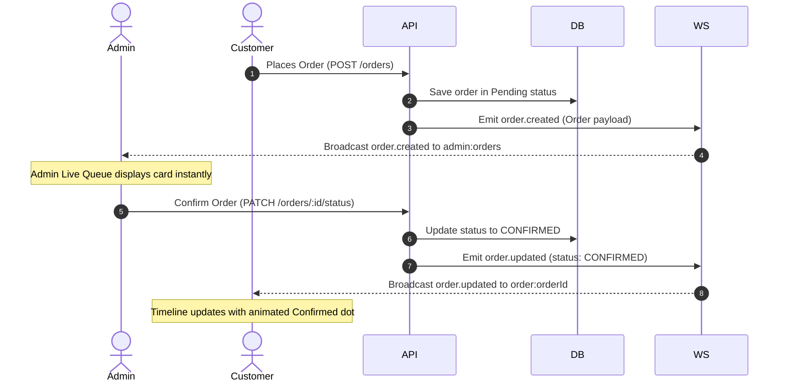

# FOODFLOW 2.1 — System Architecture

This document describes the high-level system architecture, data flow paths, security model, and real-time synchronization pipelines of the FOODFLOW application.

---

## 🏗️ High-Level Design

The application consists of a decoupled Client (Next.js) and API/WebSocket Server (NestJS), sharing a Postgres relational database.

---

## 🔑 Authentication & Security Model

FOODFLOW implements a stateless JWT-based authentication system with **Token Rotation** to protect user accounts and session lifecycles.

### Protection Guards
1.  **JwtAuthGuard**: Validates the access token in the Authorization header.
2.  **RolesGuard**: Restricts access based on user role (`ADMIN` vs `CUSTOMER`).
3.  **StatusGuard**: Blocks requests if the user's status is `BLOCKED`.

---

## 📡 Real-Time WebSocket Pipeline

WebSockets via **Socket.IO** enable instantaneous interface updates for order statuses and queue management without manual reloading.

### Room Subscriptions
Clients subscribe to distinct rooms on connection:
*   **Customer Rooms**: Subscribed to `order:orderId` to track specific delivery milestones.
*   **Admin Room**: Subscribed to `admin:orders` to monitor the live incoming order queue.

### State Synchronization Flow

---

## 🖼️ Image Management (Cloudinary Upload)

To handle food item images, the platform utilizes Cloudinary:
1.  **Upload**: The administrator selects an image file. The frontend transmits a multipart/form-data request to the backend.
2.  **CDN Integration**: The backend processes the request and streams the upload to Cloudinary.
3.  **Database Storage**: Only the secure CDN URL returned by Cloudinary is stored in the database.
4.  **Mock Fallback**: If Cloudinary credentials are not set, a fallback mock service generates placeholder food imagery URLs automatically.
