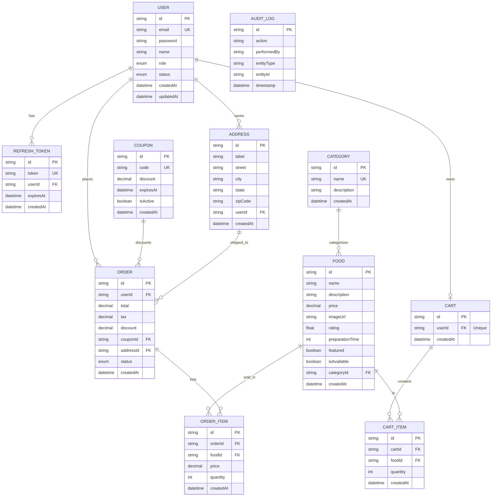

# FOODFLOW 2.1 — Database Schema

FOODFLOW uses PostgreSQL managed via the Prisma ORM. This document details the database models, relations, schemas, constraints, and indexes.

---

## 📊 Entity Relationship Diagram

---

## 💾 Schema Specifications

### `User` Table
Holds account information and roles.
*   `id` (UUID, Primary Key)
*   `email` (String, Unique, Index)
*   `password` (String, hashed using bcrypt)
*   `name` (String)
*   `role` (Enum `CUSTOMER` | `ADMIN`, Default: `CUSTOMER`)
*   `status` (Enum `ACTIVE` | `BLOCKED`, Default: `ACTIVE`)

### `RefreshToken` Table
Maintains rotated active tokens for rotation validation.
*   `id` (UUID, Primary Key)
*   `token` (String, Unique, Index)
*   `userId` (UUID, Foreign Key, Cascades on User Delete)
*   `expiresAt` (DateTime)

### `Address` Table
Supports saved addresses.
*   `id` (UUID, Primary Key)
*   `label` (String, e.g. "Home", "Office")
*   `street` (String)
*   `city` (String)
*   `state` (String)
*   `zipCode` (String)
*   `userId` (UUID, Foreign Key, Cascades on User Delete)

### `Category` Table
Food groups (e.g. Pizza, Burgers, Drinks).
*   `id` (UUID, Primary Key)
*   `name` (String, Unique)
*   `description` (String, Optional)

### `Food` Table
Individual food items.
*   `id` (UUID, Primary Key)
*   `name` (String)
*   `description` (String)
*   `price` (Decimal @db.Decimal(10,2)) — **No floats used for money**
*   `imageUrl` (String URL)
*   `rating` (Float, Default: 5.0)
*   `preparationTime` (Int, minutes)
*   `featured` (Boolean, Default: false)
*   `isAvailable` (Boolean, Default: true)
*   `categoryId` (UUID, Foreign Key connecting to Category, Cascades on Category Delete)

### `Cart` Table
Each customer has exactly one shopping cart.
*   `id` (UUID, Primary Key)
*   `userId` (UUID, Unique, Foreign Key, Cascades on User Delete)

### `CartItem` Table
Items inside a cart.
*   `id` (UUID, Primary Key)
*   `cartId` (UUID, Foreign Key, Cascades on Cart Delete)
*   `foodId` (UUID, Foreign Key, Cascades on Food Delete)
*   `quantity` (Int, Default: 1)
*   *Unique Constraint*: (`cartId`, `foodId`)

### `Order` Table
Tracks placed customer purchases.
*   `id` (UUID, Primary Key)
*   `userId` (UUID, Foreign Key, Cascades on User Delete)
*   `total` (Decimal @db.Decimal(10,2))
*   `tax` (Decimal @db.Decimal(10,2))
*   `discount` (Decimal @db.Decimal(10,2))
*   `couponId` (UUID, Foreign Key, Set Null on Coupon Delete)
*   `addressId` (UUID, Foreign Key, Restrict Delete on Address)
*   `status` (Enum `PENDING` | `CONFIRMED` | `PREPARING` | `OUT_FOR_DELIVERY` | `DELIVERED` | `CANCELLED`, Default: `PENDING`)

### `OrderItem` Table
Frozen snapshot of food information at the time of purchase.
*   `id` (UUID, Primary Key)
*   `orderId` (UUID, Foreign Key, Cascades on Order Delete)
*   `foodId` (UUID, Foreign Key, Restrict Delete on Food)
*   `price` (Decimal @db.Decimal(10,2)) — *Snapshotted price*
*   `quantity` (Int)

### `Coupon` Table
Deduction codes.
*   `id` (UUID, Primary Key)
*   `code` (String, Unique, Index)
*   `discount` (Decimal @db.Decimal(10,2), representing flat amount or percentage decimal)
*   `expiresAt` (DateTime)
*   `isActive` (Boolean, Default: true)

### `AuditLog` Table
Administrative operations log.
*   `id` (UUID, Primary Key)
*   `action` (String, e.g. "CREATE_FOOD", "UPDATE_ORDER", "BLOCK_USER")
*   `performedBy` (String, performer email address)
*   `entityType` (String, e.g. "FOOD", "ORDER", "USER")
*   `entityId` (String, Optional)
*   `timestamp` (DateTime, Default: Now, Index)

---

## ⚡ Indexing & Optimization Strategy

For query performance, the following custom indexes are created:
1.  `User.email`: Accelerates lookup during login/registration checks.
2.  `RefreshToken.token`: Resolves auth check handshakes instantly.
3.  `Coupon.code`: Speeds up validator routines during cart calculations.
4.  `AuditLog.timestamp`: Optimizes dashboard chronological audits.
5.  All relational IDs (`userId`, `categoryId`, `cartId`, `orderId`) are indexed to optimize table joins.
